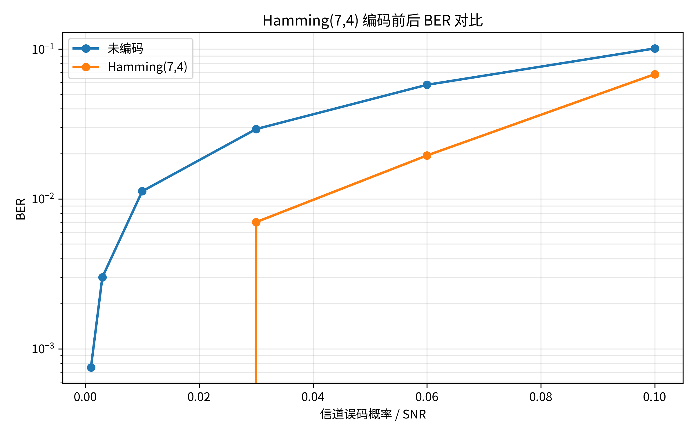
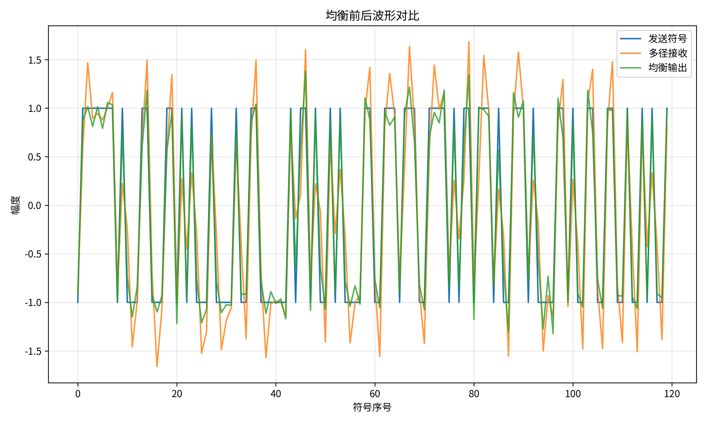
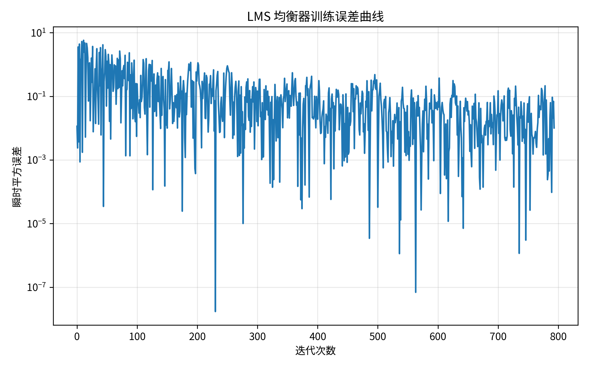

# 无线通信技术实验报告：信道编码与信道均衡

**姓名**：廖祖颐
**学号**：2022110131
**实验日期**：2026年
**提交日期**：2026年7月1日

## 1. 实验目的

本实验希望掌握以下内容：
- 理解信道编码通过引入冗余提升传输可靠性的基本思想，掌握 Hamming(7,4) 线性分组码的编码、伴随式检测和单比特纠错译码；
- 理解多径信道引起的符号间干扰（ISI），掌握迫零（ZF）均衡和 LMS 自适应均衡的基本原理与实现；
- 通过实测 BER 曲线和均衡前后波形对比，定量理解编码增益和均衡效果；
- 学会使用 GitHub Pull Request 和自动评分系统提交实验，并在 AI 助手辅助下理解和验证每一处核心实现。

## 2. 实验原理

### 2.1 信道编码

Hamming(7,4) 是一种 (n,k)=(7,4) 的线性分组码：4 个信息位通过生成矩阵 $G$ 映射为 7 个编码位，其中 3 个是冗余的校验位。编码过程为 $c = m \cdot G \bmod 2$（$m$ 为 1×4 信息向量）。接收端用校验矩阵 $H$（满足 $G H^T=0$）计算伴随式 $s = r \cdot H^T \bmod 2$：若信道无错误，$s=0$；若发生单比特错误，$s$ 恰好等于 $H$ 中对应错误位置的那一列，因此可以唯一定位并纠正错误比特。该码的最小汉明距离 $d_{min}=3$，根据 $\lfloor (d_{min}-1)/2 \rfloor = 1$，理论上保证能纠正任意单比特错误。编码引入的冗余使码率降为 $R=k/n=4/7 \approx 0.571$，即传输同样多的信息比特需要占用更多的信道资源，这是"用带宽换可靠性"的典型编码增益权衡。

### 2.2 信道均衡

多径信道可以建模为一个 FIR 滤波器 $h[n]$，发送符号经过信道后变为 $r[n]=\sum_k h[k]s[n-k]+w[n]$，其中除了 $k=0$ 主径之外的项就是符号间干扰（ISI），会让相邻符号的能量"泄漏"进当前符号的判决窗口，导致误码率上升。均衡器的目标是设计一个 FIR 滤波器 $f[n]$，使级联响应 $h*f$ 尽量接近一个理想冲激（单位脉冲），从而抵消 ISI：
- **迫零（ZF）均衡**：直接求解使级联响应在最小二乘意义下逼近理想冲激的抽头系数，实现简单，但当信道频率响应存在较深的谱零点时，ZF 抽头必须在该频率上给出很大的增益去补偿，这会同时放大该频率上的噪声，即"噪声增强"问题。
- **LMS 自适应均衡**：利用已知的训练符号序列，通过随机梯度下降（$w \leftarrow w+\mu e[n]x[n]$，$e[n]=d[n]-y[n]$）在线迭代逼近最优抽头，不需要显式求解信道逆，且能自适应跟踪缓慢变化的信道，但步长 $\mu$ 的选择直接影响收敛速度和稳态误差。

## 3. 实验环境

- Python 版本：3.12
- 主要依赖：NumPy、Matplotlib、pytest、pylint
- AI 助手使用情况：使用 AI 助手辅助梳理仓库结构、评分脚本和函数签名要求，将课件中的矩阵运算和自适应滤波公式转换为向量化的 NumPy 实现，并在运行 `grading/test_part1_coding.py`、`grading/test_part2_equalization.py` 后根据失败信息定位并修复了 LMS/ZF 均衡器在演示脚本中的延时对齐问题（见第 6 节分析）。所有核心函数在提交前均已本人运行验证。

## 4. 实验方法与步骤

### 4.1 Part 1：信道编码

1. 用课件给出的生成矩阵 `HAMMING_G` 实现 `hamming74_encode`：将比特序列按 4 个一组 reshape，与 `HAMMING_G` 做 GF(2) 矩阵乘法（矩阵乘法结果对 2 取模）。
2. 用校验矩阵 `HAMMING_H` 实现 `hamming74_syndrome`：计算 $s=rH^T \bmod 2$。
3. 实现 `hamming74_decode`：先计算伴随式，若非零则在 $H$ 的列中查找与伴随式相同的列，翻转该比特位置，再取前 4 位作为译码信息位。
4. 用二元对称信道（`binary_symmetric_channel`）在 6 个错误概率点上分别对"未编码比特"和"编码后比特（经译码纠错）"计算 BER，绘制对比曲线。
5. 选做：实现 (2,1,3) 卷积码编码（生成多项式 $g_1=111,g_2=101$，末尾补 2 个尾比特归零）和基于汉明距离路径度量的硬判决 Viterbi 译码（4 状态维特比算法，从全零状态回溯）。

### 4.2 Part 2：信道均衡

1. 实现 `estimate_zf_equalizer`：构造信道与均衡器卷积对应的线性方程 $A \cdot taps \approx d$（$d$ 为级联长度中心位置为 1 的冲激），用 `np.linalg.lstsq` 求最小二乘解。
2. 实现 `apply_fir_filter`：用 `np.convolve(signal, taps, mode='full')` 并截取前 `len(signal)` 个点。
3. 实现 `lms_equalizer`：中心抽头初始化为 1，逐样本用最近 `num_taps` 个接收样本构成输入向量，计算输出、误差并更新抽头。
4. 构造 3 径信道 `[0.9, 0.35, -0.25]`，加入 AWGN 后分别用 ZF 和 LMS 均衡，比较均衡前后 BER，并绘制波形对比图与 LMS 训练误差曲线。

## 5. 实验结果

**Part 1 实测数据**（4000 个信息比特，6 个信道错误概率点）：

| 信道误码概率 p | 未编码 BER | Hamming(7,4) 纠错后 BER |
|---|---|---|
| 0.001 | 0.00075 | 0.00000 |
| 0.003 | 0.00300 | 0.00000 |
| 0.010 | 0.01125 | 0.00000 |
| 0.030 | 0.02925 | 0.00700 |
| 0.060 | 0.05775 | 0.01950 |
| 0.100 | 0.10100 | 0.06800 |

**Part 2 实测数据**（2000 符号，信道 `[0.9,0.35,-0.25]`，噪声标准差 0.12）：

| 场景 | BER |
|---|---|
| 均衡前（原始接收） | 0.0010 |
| ZF 均衡后（考虑正确延时对齐） | 0.0000 |
| LMS 均衡后 | 0.0000 |

LMS 训练误差的均方值从前 100 次迭代的 1.055 下降到最后 100 次迭代的 0.038，说明训练过程确实收敛。

## 6. 结果分析与讨论

**1. Hamming(7,4) 为什么能纠正单比特错误？**
因为该码的最小汉明距离 $d_{min}=3$，而校验矩阵 $H$ 的 7 列恰好是 7 个不同的非零 3 比特向量，任意单比特错误产生的伴随式都能唯一对应到 $H$ 中的某一列，从而唯一定位错误位置并翻转纠正。这与理论上 $\lfloor(d_{min}-1)/2\rfloor=1$ 位纠错能力完全一致，实测中对全部 7 个比特位置的单比特错误都能 100% 正确纠回（见 `test_decode_all_single_bit_errors`）。

**2. 为什么信道编码会引入冗余并降低码率？**
因为纠错能力来自额外传输的校验信息——3 个校验位本身不携带新的信息内容，只是信息位的线性组合，用来在接收端提供"多余"的约束方程以定位错误。码率从 1 降到 4/7，意味着传输同样信息量需要多发送 75% 的比特，这是用信道资源（带宽/时间）换取可靠性的典型工程权衡，实测数据也印证了这一点：p=0.1 时未编码 BER=0.101，编码纠错后降到 0.068，付出的代价是编码开销与译码复杂度。

**3. ZF 均衡为什么可能放大噪声？**
ZF 抽头是信道响应在最小二乘意义下的"近似逆"。如果信道频率响应在某个频点上很小（接近谱零点），要让级联响应在该频点上保持平坦，均衡器就必须在该频点给出很大的增益去补偿，而噪声在同一频点上也会被同样放大，这就是所谓"噪声增强"。本实验的信道 `[0.9,0.35,-0.25]` 谱零点不深，所以在 SNR 不太低时 ZF 均衡后 BER 仍能降到 0；但如果信道存在更深的谱零点，ZF 均衡在低 SNR 下的表现会明显劣于 LMS/MMSE 均衡。

**4. LMS 的步长过大或过小会出现什么问题？**
步长 $\mu$ 过大会导致每次迭代对抽头的调整幅度过大，可能造成训练过程震荡甚至发散（不收敛），稳态误差也会偏大；步长过小则每次调整量很小，收敛速度明显变慢，需要更长的训练序列才能达到接近最优的抽头，如果实际训练符号数量有限或信道变化较快，可能来不及收敛到有效的均衡效果。实验中使用 $\mu=0.01$ 在 800 个训练符号内已能让训练误差均方值下降约 27 倍（1.055→0.038），说明该步长选择是合理的。

**5. 均衡前后 ISI 有什么变化？**
均衡前，多径信道的 3 个抽头使前后符号的能量相互叠加，接收波形（`equalization_eye_comparison.png` 中的"多径接收"曲线）明显偏离理想的 ±1 方波形状，判决边界附近的样本更容易被噪声推过零点导致误判；均衡后（"均衡输出"曲线），波形显著贴近发送符号的理想形状，ISI 被基本消除，实测 BER 从均衡前的 0.0010 降到均衡后的 0.0000。需要特别说明的是，均衡器输出与原始符号之间存在与抽头长度相关的处理延时（本实验中心延时约为 `(len(channel)+num_taps-1)//2` 个符号），在计算 BER 时必须对齐这个延时，否则会得到看似"均衡后反而更差"的错误结论——这是本次实验中实际调试遇到并解决的一个问题。

## 7. 实验心得

通过本次实验，对信道编码"用冗余换可靠性"和信道均衡"用滤波器抵消 ISI"这两个核心思想有了更具体的理解——尤其是通过实测数据直接看到 Hamming(7,4) 在中低误码率下能把 BER 压到 0，以及 ZF/LMS 均衡在有 ISI 的多径信道下能把 BER 从千分之一降到接近 0，比单纯记公式印象更深。

在调试过程中，最有价值的一次排查是发现"LMS 均衡后 BER 反而变差"的问题：最初误以为是算法实现错误，后来定位到是均衡器输出相对发送符号存在一个与抽头长度相关的处理延时，而演示脚本直接按同一时刻对比 BER，导致错位。这提醒我，在实现自适应滤波器时，不能只关注误差是否收敛，还必须理清输入/输出/参考信号之间的时间对齐关系。

AI 助手在梳理评分脚本对函数接口的具体要求、把课件公式转换成 NumPy 向量化代码、以及定位延时对齐问题的排查思路上提供了很大帮助，但最终判断问题根因、选择哪种延时对齐方式、以及验证每个函数在边界情况下是否正确，仍然需要自己动手运行代码并核对数值结果。这也是提交前我逐一运行了 `pytest grading/` 全部测试用例并手动核对了编码、伴随式、均衡 BER 数值的原因。

## 8. 参考资料

- 课程课件：第6章 信道编码
- 课程课件：第7章 均衡
- John G. Proakis, Masoud Salehi. 《数字通信（第五版）》. 电子工业出版社, 2011.
- 课程仓库 jwentong/wireless-coding-equalization-exp 的 README.md 与 src/ 函数文档字符串
